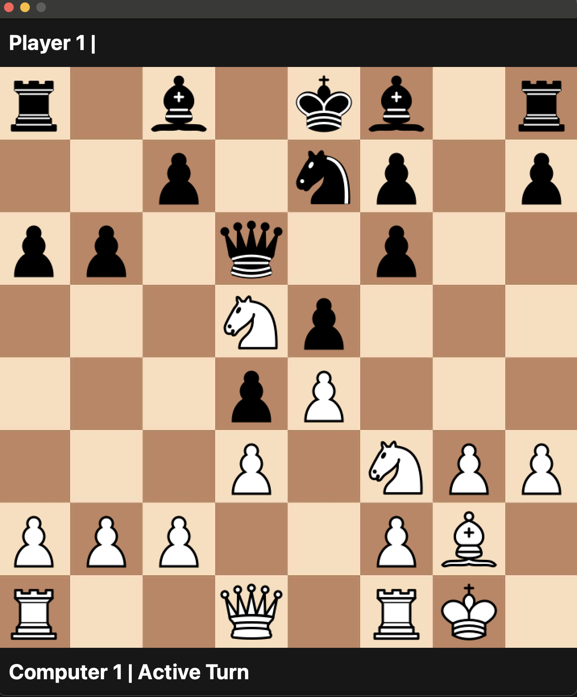

# Chess AI

A hybrid desktop chess application pairing a responsive PySide6 user interface with a high-performance, multithreaded Rust engine core capable of evaluating millions of positions per second.

The engine has been unofficially benchmarked and validated against 2900 Elo bots on Chess.com.

- Benchmark - Approximately 8.2 Million Nodes per second on a Apple M4 Pro Chip.

## 1. Python Presentation & Validation Layer
    
- **PySide6 UI:** Renders a fluid 2D chessboard and manages real-time player drag-and-drop interactions

- **Move Validation:** Enforces legal moves and coordinates state synchronization with the engine core

- **Opening Handbook:** Integrates a built-in opening book containing standard opening lines

## 2. Rust Engine Core

- **Bitboard Move Generation:** Maximizes throughput by computing all pseudo-legal move paths across millions of positions per second

- **Adversarial Search:** Implements Minimax search enhanced by Alpha-Beta pruning and a Quiescence search to eliminate horizon-effect instability

- **Deep Evaluation:** Combines Iterative Deepening with Principal Variation Search (PVS) to regularly achieve search depths of 10+ plies. (Average Move is approximately 20 seconds to 1.5 minutes)

- **Transposition Tables:** Caches previously evaluated board states to accelerate search paths and share data across threads

- **Parallel Processing:** Scales performance across CPU threads using a lock-free concurrent tree search architecture (Lazy SMP)

- **Performance Benchmark:** Processes approximately 8.2 million nodes per second (NPS) on an Apple M4 Pro chip.

> **Note:**: The transposition table implementation (transposition_table.rs) utilized AI-assisted generation and relies on open-source algorithmic paradigms. I do not claim sole authorship over this specific module.

## 3. Neural Network Evaluation

- **NNUE Integration:** Features an incrementally updated Efficiently Updatable Neural Network (NNUE) paired with the Universal Chess Interface (UCI) protocol.

> **Current Limitations:**: The engine currently utilizes the Timecat NNUE backend; This third-party library cannot process pseudo-positions or invalid board states and thus the Null-Move Pruning (NMP) is currently disabled. 

> **Future Roadmap:**: This dependency will be replaced with a custom, self-trained NNUE framework designed to handle perspective shifts during abstract pruning phases.

# Running the App

## Prerequisites

The user nedes Python 3, PySide6, and Cargo (Rust) installed on their machine.

Playing as [black|white]
- /run.sh [black|white]

# Playing Level

The Chess AI has been tested and consistently drew against ELO 2900 chess.com bots.

- [WIN - ELO 2900 Bot](https://www.chess.com/analysis/game/computer/1550643276/analysis)
- [DRAW - ELO 2900 Bot](https://www.chess.com/analysis/game/computer/1550461094/analysis)
- [DRAW - ELO 2700 Bot](https://www.chess.com/analysis/game/computer/1547096612/analysis)

## Contact

Alan Yuan

| Platform | Link | Intent |
| :--- | :--- | :--- |
| **Email** | [alan0408yuan@gmail.com](mailto:alan0408yuan@gmail.com) | Direct inquiries |
| **LinkedIn** | [linkedin.com](https://www.linkedin.com/in/alan-yuan-62301272/) | Professional networking |

*Response time: Typically within 24 hours.*