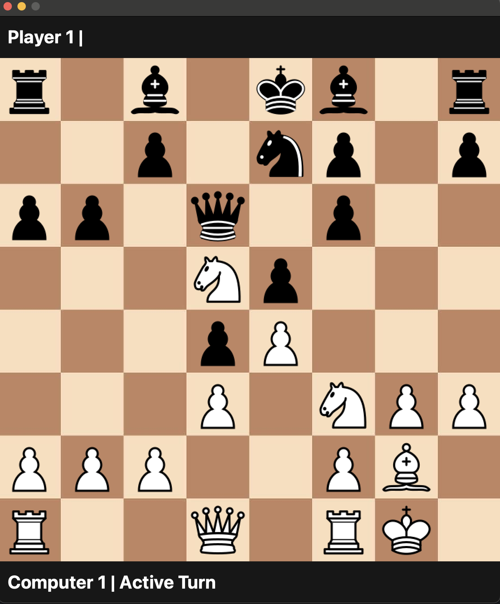

# Alan AI Chess

- **Presentation Layer:** Python PySide6 for drag and drop interface
  
- **Compute Engine:** Rust Maturin for Adversarial Search - Negamax with Quiescence Search with advanced pruning techniques such as Killer Move Heuristics, Late Move Reduction, Principal Variation Search, and Null-Move Pruning.

  The engine processes 10+ million nodes per second on Apple M4 Pro (8 Performance Threads) and averages 14+ depth on 20 second search. 

- **Move Generation:** BitBoard for board representation and BitBoard Magic Number to calculate moves for sliding pieces. 

- **Evaluation:** Self-trained NNUE (Dual-Perspective HalfKA) using Lichess FEN -> Score Positions.

- **NNuE Training:** Trained on [Lichess Chess Position Evaluations](https://huggingface.co/datasets/Lichess/chess-position-evaluations).

  The positions are filtered for Quiet Positions and the score is converted to a win percentage between [0 to 1] using a Sigmoid Function.
  
## 1. Python Presentation & Validation Layer

- **PySide6 UI:** Renders a fluid 2D chessboard and manages real-time player drag-and-drop interactions

- **Move Validation:** Enforces legal moves and coordinates state synchronization with the rust compute engine

- **Opening Handbook:** Integrates a built-in opening book containing standard opening lines

## 2. Rust Compute Engine

- **Bitboard Move Generation:**  Uses 64-bit integers with fast AND / XOR logic to compute board occupancy. It also uses BitBoard Magic Number to instant compute sliding pieces moves and attacks.

- **Adversarial Search:** Implements Minimax (Negemax) adversarial search and uses Quiescence Search to extend the search for non-quiet positions to mitigate the horizon effect.

- **Advanced Pruning:** Uses Killer Move Heuristics, Late Move Reduction and Null-Move Pruning. to improve the Alpha / Beta cutoff. 

- **Deep Evaluation:** Combines Iterative Deepening with Principal Variation Search (PVS) to regularly achieve search depths of 14+ plies. (Average Move is approximately 20+ seconds).

- **Transposition Tables:** Caches previously evaluated board states to accelerate search paths in a lockless transposition Table. The tables uses the Condon-Thompson Replacement method to increase efficiency of L1 / L2 / L3 caches by prioritizng positions that are frequently traversed positions and evaluations with strong depth. 

- **Zobrist Hash:** Uses a unique 64-bit Zobrist Hashing for every board position and is incrementally updated using XOR operations; This is used for detecting three-move repetition and in the Transposition Table

- **Parallel Processing:** The search uses Lazy SMP (Symmetric Multiprocessing) which uses multiple search algorithms to independently process the same search evaluation agorithm and share position evaluations and cut-offs using a shared Lockless Transposition table.

- **Performance Benchmark:** Processes approximately 10+ million nodes per second (NPS) on an Apple M4 Pro chip. (8 Performance Core Only - 4.5 GHz + On-Chip Cache Memory - 39.5 MB)

## 3. Neural Network Evaluation

- **NNuE Architecture:** The engine features a customized **Dual-Perspective HalfKA** perspective neural network utilizing a hybrid quantization layout. The architectural data pathways progress as follows:
  
  $$\text{Inputs (49,152)} \rightarrow \text{Accumulator (256)} \rightarrow \text{Multiplexed Perspective (512)} \rightarrow \text{Hidden 2 (64)} \rightarrow \text{Hidden 3 (32)} \rightarrow \text{Output (1)}$$

  - **Input Layer:** $12 \times 64 \times 64 = 49,152$ sparse features mapping active piece-square configurations relative to your own active King's position.
  - **Accumulator Layer:** Shapes into $(49152, 256)$ weights and $(256,)$ biases quantized to signed 16-bit integers (`i16`). Uses branchless tensor multiplexing to concatenate White/Black points of view into a unified $512$-dimensional vector.
    - *Activation:* Clipped/Bounded Linear ReLU ($\text{ReLU1}$) bounded strictly between `0.0` and `1.0`.
  - **Hidden Layer 2:** Matrix transformation mapping $(512, 64)$ quantized to signed 8-bit weights (`i8`) and 32-bit biases (`i32`).
    - *Activation:* Clipped/Bounded Linear ReLU ($\text{ReLU1}$) bounded strictly between `0.0` and `1.0`.
  - **Hidden Layer 3:** Matrix transformation mapping $(64, 32)$ quantized to signed 8-bit weights (`i8`) and 32-bit biases (`i32`).
    - *Activation:* Clipped/Bounded Linear ReLU ($\text{ReLU1}$) bounded strictly between `0.0` and `1.0`.
  - **Output Layer:** Combines $(32, 1)$ outputs down to a single evaluation scalar using 8-bit weights (`i8`) and 32-bit biases (`i32`).
    - *Activation:* ($\text{activation=None}$). Output Pawn Unit. 
  
- *The Training Model applies a Sigmoid Function (Smoothing Function) before feeding it into the Mean Squared Loss Function 

## 4. NNuE Training

- **Training Data:** The positions are sourced from [Lichess Chess Position Evaluations](https://huggingface.co/datasets/Lichess/chess-position-evaluations), which contains 394,669,566 chess positions evaluated with Stockfish at various depths. The training / validation data use different shards and the training data is shuffled to ensure an even distribution. 

  The data is preprocessed for [White Prespective] [Black Prespective] for Dual-Perspective HalfKA NNUE and is filtered to only include Quiet Positions - The king isn't in check and Quiescence Search doesn't drop the Standing Pat. 

- **Training Process:** The model is trained using 45 Epoch, with 976 Steps and 4096 FEN training values in each step. The model will lower its learning rate if 4 consecutive epoches fail to produce a stronger model. The model loss is measured in BinaryCrossentropy to heavily penalize incorrect errors to produce strong gradients for learning. 

  The model applies a Sigmoid transformation to the score output as a win percentage - 1.0 (win), 0.5 (draw), and 0.0 (loss) to reduce gradients for positions with -/+ 400 Centipawns; The goal is to force the model to focus more on close board positions rather than accomodating for outliers such as -/+ 1500 Centipawns.

## 5. Playing Level

The Chess AI has been tested against ELO 3200+ Chess.com bots.

- [WIN - ELO 3200 Bot](https://www.chess.com/analysis/game/computer/1617707258/analysis)
- [DRAW - ELO 3200 Bot](https://www.chess.com/analysis/game/computer/1562860054/analysis)
- [DRAW - ELO 3200 Bot](https://www.chess.com/analysis/game/computer/1574164820/analysis)

- **Future Roadmap:** This engine has not been officially ratified by Computer Chess Rating Lists

## 6. Running the App

Playing as [black|white]
- /run.sh [black|white]

## 7. Contact

Alan Yuan

| Platform | Link | Intent |
| :--- | :--- | :--- |
| **Email** | [alan0408yuan@gmail.com](mailto:alan0408yuan@gmail.com) | Direct inquiries |
| **LinkedIn** | [linkedin.com](https://www.linkedin.com/in/alan-yuan-62301272/) | Professional networking |

*Response time: Typically within 24 hours.*
